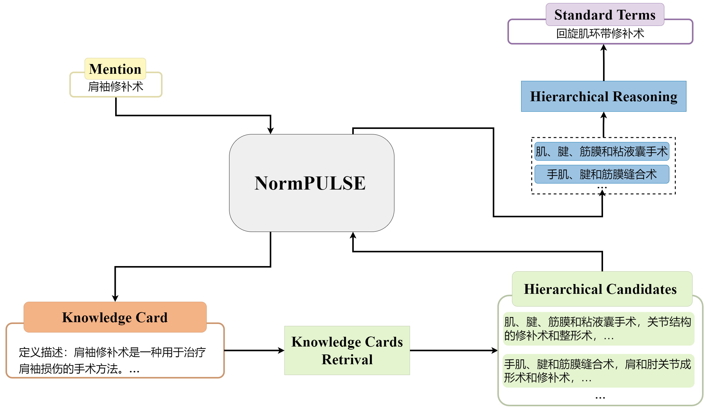

# ![testing]!NormPULSE: A Generative Approach for Clinical Term Normalization

<!--
**Here are some ideas to get you started:**
🙋‍♀️ A short introduction - what is your organization all about?
🌈 Contribution guidelines - how can the community get involved?
👩‍💻 Useful resources - where can the community find your docs? Is there anything else the community should know?
🍿 Fun facts - what does your team eat for breakfast?
🧙 Remember, you can do mighty things with the power of [Markdown](https://docs.github.com/github/writing-on-github/getting-started-with-writing-and-formatting-on-github/basic-writing-and-formatting-syntax)
-->

This repository is a sub-repository of [PULSE](https://github.com/openmedlab/PULSE).


---

## Key Features

This repository provides the official implementation of NormPULSE.

Key feature bulletin points here
- A knowledge transfer approach that utilizes data distillation from LLMs through prompt engineering, converting short clinical terms into knowledge cards that contain enhanced information and clinical knowledge.
- Leverage the hierarchical structure in the standard term and develop an algorithm for building the tree structure with ICD codes.
- A generative framework, to find the candidate terms via knowledge-enhanced retrieval and generate the final standard term with hierarchical reasoning.

<!-- give an introduction of your project -->
## Details

We outline the comprehensive framework of our solution to clinical term normalization, NormPULSE, which is based on PULSE and comprises three steps: 
1. Training, There are three tasks in the training step, knowledge card generation, aiming at enhancing the knowledge inside term by distilling knowledge from LLM; hierarchical tree construction based on the ICD codes and term normalization, making the model get the ability to select the standard terms from a certain candidate list.  
2. knowledge-enhanced retrieval, the model retrieves candidates for the given mention using the generated knowledge cards and locates each candidate's path in the constructed hierarchical tree to build a subtree.
3. hierarchical reasoning, the model reasons out the final result layer by layer through the subtree.

<!-- Insert a pipeline of your algorithm here if got one -->


## Dataset
The part of clinical term normalization data is based on the following two open-source datasets.
- [Yidu-N7k](http://openkg.cn/dataset/yidu-n7k)
- [CHIP-CDN](https://tianchi.aliyun.com/dataset/95414)

The standard terminology database is [ICD-10医保2.0版](https://code.nhsa.gov.cn/search.html?sysflag=80) and [ICD-9-CM3医保2.0版](https://code.nhsa.gov.cn/search.html?sysflag=80), and we construct the two corresponding code trees by parsing the term codes, which are available at [ICD-10_医保v2_tree.json](data/ICD-10_医保v2_tree.json) and [ICD-9-CM3_医保v2_tree.json](data/ICD-9-CM3_医保v2_tree.json)

We also provide the examples of the training data at the [data directory](data/).  

## Get Started
### Model Setup
**Main Requirements**  
> python=3.9.16  
> transformers>=4.29.2  
> faiss-gpu==1.7.2  
> torch==2.0.1
> sentence-transformers==2.2.2  
> fastapi  
> uvicorn  
> [NodeJS](https://nodejs.org/en)>=18.x  
> GPU memory 16 GB at least.
> Make sure your frontend port 3000 and backend port 2233 is available, and you can change them in [main.ts](./demo-frontend/src/main.ts) and [run.py](./demo-backend/run.py)

**Installation**
```bash
git clone https://github.com/JOHNNY-fans/NormPULSE.git
cd NormPULSE
conda create -n normllm python=3.9.16
conda activate normllm
pip install -r requirements.txt
```

**Download Model**  
You can find the NormPULSE weights in the following huggingface repository.  
- [NormPULSE](https://huggingface.co/Johnnyfans/normpulse)

In the retrieval step, we select the open-source [M3E](https://huggingface.co/moka-ai/m3e-base) model as the text embedding model.

**Usage**  
We provide a sample usage in a jupyter notebook [usage_example.ipynb](https://github.com/JOHNNY-fans/NormPULSE/blob/main/usage_example.ipynb)

### Demo Setup
Here is our simple demo.


**Run Frontend**

```sh
cd demo-frontend
npm i  
npm run dev
```


**Run Backend**

```bash
cd demo-backend
python run.py
```

## 🛡️ License

The code of this project is licensed under [Apache 2.0](https://github.com/JOHNNY-fans/NormPULSE/blob/main/LICENSE), and the model weights are licensed under [GNU AGPL 3.0](https://github.com/JOHNNY-fans/NormPULSE/blob/main/MODEL_LICENSE). If the models contained in this project, or any modified versions thereof, are used in a service that results in misleading or harmful statements causing adverse effects, the responsibility lies with the service provider and is not associated with or attributable to this project.

## 🙏 Acknowledgement

- Shanghai AI Laboratory.
- East China University of Science and Technology.
